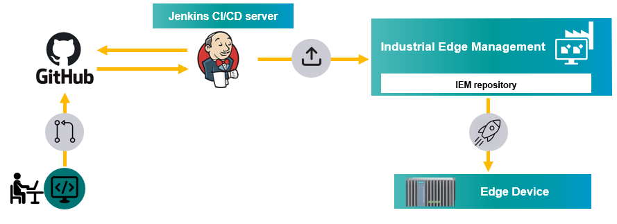

# CI/CD pipelines with Jenkins 

Automate process of uploading apps to IEM with Jenkins.

- [CI/CD pipelines with Jenkins](#cicd-pipelines-with-jenkins)
  - [Description](#description)
    - [Overview](#overview)
    - [General task](#general-task)
  - [Requirements](#requirements)
    - [Prerequisities](#prerequisities)
    - [Used components](#used-components)
  - [Installation steps](#installation-steps)
  - [Documentation](#documentation)
  - [Contribution](#contribution)
  - [Licence & Legal Information](#licence--legal-information)

## Description

###  Overview
This application example shows how to create Jenkins CI/CD pipelines to automatically upload applications to Industrial Edge Management system.

### General task
The main goal of this example is to show how to setup Jenkins server and create Jenkins pipelines to upload applications to IEM. Jenkins can be integrated with several Git providers but GitHub is used for this example. With GitHub webhook feature it is possible on every commitment to the GitHub repository to automatically trigger Jenkins pipeline on a Jenkins server that build, test and upload application to IEM. 

## Requirements

###  Prerequisities

- Installed Industrial Edge Management
- Installed system configurators
- Installed system applications
- VM (will be used for Jenkins) with docker and docker-compose installed
- VM has connection to IEM

### Used components

- Industrial Edge Device V 1.1.0-34
- Industrial Edge Management system V 1.1.0-39-amd64
- Ubuntu 20.04 development VM
- Docker V 19.03.13

## Installation steps
The repository is devided into two main directories. The [Jenkins-installation](./Jenkins-installation) describes the process of setting up the Jenkins server in order to run CI/CD jobs. The documentation for the installation steps can be found [here](./Jenkins-installation/installation.md). 

The [pipeline](./pipeline) folder constist of Jenkins pipeline implementation using either shell script or docker. The documentation for each implementation describes the process of connecting GitHub repository with Jenkins using webhooks and creating Jenkins pipelines to automatically upload app to IEM on every push. 

## Documentation

- You can find further documentation and help in the following links
  - [Industrial Edge Hub](https://iehub.eu1.edge.siemens.cloud/#/documentation)
  - [Industrial Edge Forum](https://www.siemens.com/industrial-edge-forum)
  - [Industrial Edge landing page](https://new.siemens.com/global/en/products/automation/topic-areas/industrial-edge/simatic-edge.html)
  
## Contribution
Thanks for your interest in contributing. Anybody is free to report bugs, unclear documenation, and other problems regarding this repository in the Issues section or, even better, is free to propose any changes to this repository using Merge Requests.

## Licence & Legal Information
Please read the [Legal information](LICENSE.md)