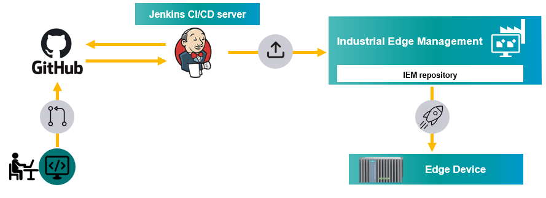

# CI/CD pipelines with Jenkins 

Automate process of uploading apps to IEM with Jenkins.

- [CI/CD pipelines with Jenkins](#cicd-pipelines-with-jenkins)
  - [Description](#description)
    - [Overview](#overview)
    - [General task](#general-task)
  - [Requirements](#requirements)
    - [Prerequisites](#prerequisites)
    - [Used components](#used-components)
  - [Installation steps](#installation-steps)
  - [Documentation](#documentation)
  - [Contribution](#contribution)
  - [License and Legal Information](#license-and-legal-information)
  - [Disclaimer](#disclaimer)

## Description

###  Overview
This application example shows how to create Jenkins CI/CD pipelines to automatically upload applications to the Industrial Edge Management.

### General task
The main goal of this example is to show how to setup [Jenkins](https://jenkins.io/) server and create Jenkins pipelines to upload applications to IEM. Jenkins can be integrated with several Git providers but GitHub is used for this example. With GitHub webhook feature it is possible on every commit to the GitHub repository to automatically trigger Jenkins pipeline on a Jenkins server that build, test and upload applications to IEM. 

## Requirements

###  Prerequisites

- Installed Industrial Edge Management
- Linux VM (will be used for Jenkins) with docker and docker-compose installed
- VM has connection to IEM

### Used components

- Industrial Edge Device V 1.1.0-39
- Industrial Edge Management V 1.1.16
- VM - Ubuntu 20.04
- Docker 19.03.13
- Jenkins 2.263.3

## Installation steps
The repository is divided into two main directories. The [docs](./docs) folder contains documentation that describes the necessary steps for installation and implementation. The documentation for the installation steps of the Jenkins server can be found [here](./docs/installation.md). The documentation for creating Jenkins pipeline using either docker or shell script can be found [here](./docs/pipeline.md). It describes the process of connecting GitHub repository with Jenkins using webhooks and creating Jenkins pipelines to automatically upload the app to a IEM, when code changes get pushed to the repository. The folder is extended by documentation describing implementation of the pipelines which can be found [here](./docs/implementation.md)

- [Setting up Jenkins Server](./docs/installation.md)
- [Setting up CI/CD Pipeline](./docs/pipeline.md)

The [src](./src) folder consist source code of Jenkins pipeline implementation using either shell script or docker. 

## Documentation
 
- You can find further documentation and help in the following links
  - [Industrial Edge Hub](https://iehub.eu1.edge.siemens.cloud/#/documentation)
  - [Industrial Edge Forum](https://forum.mendix.com/link/space/industrial-edge)
  - [Industrial Edge landing page](https://new.siemens.com/global/en/products/automation/topic-areas/industrial-edge/simatic-edge.html)
  - [Industrial Edge GitHub page](https://github.com/industrial-edge)
  - [Industrial Edge documentation page](https://docs.eu1.edge.siemens.cloud/index.html)
  
## Contribution

Thank you for your interest in contributing. Anybody is free to report bugs, unclear documentation, and other problems regarding this repository in the Issues section.
Additionally everybody is free to propose any changes to this repository using Pull Requests.

If you are interested in contributing via Pull Request, please check the [Contribution License Agreement](Siemens_CLA_1.1.pdf) and forward a signed copy to [industrialedge.industry@siemens.com](mailto:industrialedge.industry@siemens.com?subject=CLA%20Agreement%20Industrial-Edge).

## License and Legal Information

Please read the [Legal information](LICENSE.txt).

## Disclaimer

IMPORTANT - PLEASE READ CAREFULLY:

This documentation describes how you can download and set up containers which consist of or contain third-party software. By following this documentation you agree that using such third-party software is done at your own discretion and risk. No advice or information, whether oral or written, obtained by you from us or from this documentation shall create any warranty for the third-party software. Additionally, by following these descriptions or using the contents of this documentation, you agree that you are responsible for complying with all third party licenses applicable to such third-party software. All product names, logos, and brands are property of their respective owners. All third-party company, product and service names used in this documentation are for identification purposes only. Use of these names, logos, and brands does not imply endorsement.