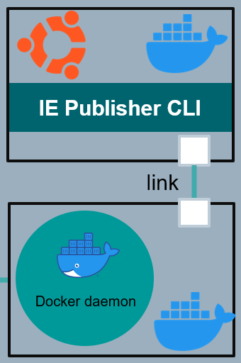

# Implementation

- [Implementation](#implementation)
  - [Shell script](#shell-script)
    - [Build stage](#build-stage)
    - [Upload stage](#upload-stage)
  - [Using Docker with Pipeline](#using-docker-with-pipeline)
    - [Build stage](#build-stage-1)
    - [Upload stage](#upload-stage-1)


## Shell script 

Jenkins pipeline using shell script in this example is implemented using so called declarative pipeline syntax. When building declarative pipeline, you start by using `pipeline` keyword. Then you can define where should the pipeline run by specifying Jenkins agent. After that, the pipeline stages shall be defined. 

### Build stage

The build stage is building docker images defined inside of the docker-compose file. 

```txt
            stage('Build') {
            steps {
                echo 'Building..'
                sh '''
                    cd app
                    docker-compose build
                '''
            }
        }

```

### Upload stage
The upload stage is responsible to perform different jobs. At first, it creates, initialize and copy application files to a workspace folder, which is used by the IECTL as a working directory. 

```txt
 stage('Upload') {
            steps {
                script {
                    def workspacedir = pwd() + "/workspace" // Capture the current directory and append /workspace
                    echo 'Uploading ...'
                    sh """
                        rm -rf ${workspacedir}
                        mkdir -p ${workspacedir}
                        cd ${workspacedir}
                        iectl publisher workspace init
                        cd ..
```

After that, the connection to a local running docker engine is established using IECTL command.

```txt
                        iectl publisher docker-engine v -u http://localhost:2375
```
The last part of the upload stage is logging into IEM using credentials stored as Jenkins environment variables, creates application version with reverse proxy configuration and uploads to the IEM repository. 

```txt
// login to IEM
                        export IE_SKIP_CERTIFICATE=true
                        export EDGE_SKIP_TLS=1

                        iectl config add publisher --name "publisherdev" --dockerurl "http://localhost:2375" --workspace ${workspacedir}

                        ls 

                        iectl config add iem --name "iemdev" --url ${IEM_URL} --user ${USER_NAME} --password '$PSWD'
                        iectl publisher standalone-app create --reponame ${REPO_NAME} --appdescription "upload using Jenkins" --iconpath ${ICON_PATH} --appname ${APP_NAME}

                        version=\$(iectl publisher standalone-app version list -a ${APP_NAME} -k "versionNumber" | python3 getAppVersion.py)

                        version_new=\$(echo \$version | awk -F. -v OFS=. 'NF==1{print ++\$NF}; NF>1{if(length(\$NF+1)>length(\$NF))\$(NF-1)++; \$NF=sprintf("%0*d", length(\$NF), (\$NF+1)%(10^length(\$NF))); print}')
                        echo 'new Version: '\$version_new

                        iectl publisher standalone-app version create --appname ${APP_NAME} --changelogs "new release" --yamlpath "docker-compose.prod.yml" --versionnumber \$version_new -n '{"hello-edge":[{"name":"hello-edge","protocol":"HTTP","port":"80","headers":"","rewriteTarget":"/"}]}' -s 'hello-edge' -t 'FromBoxReverseProxy' -u "hello-edge" -r "/"

                        iectl publisher app-project upload catalog --appname ${APP_NAME} -v \$version_new
            """
                }
            }
        } 
    }
}

```


## Using Docker with Pipeline

Jenkins pipeline using docker in this example is implemented using so called scripted pipeline syntax. When building scripted pipeline, you start by using `node` keyword. Then the `checkout` keyword is used to pull application files from the Git repository to the Jenkins server. After that, you can specify the docker images to be used inside of the pipeline. In this example we use 2 docker containers. The `docker:18.09-dind` container is pulled from Docker Hub and it is used as a service container with docker daemon exposed on port 2375. The second container is a custom docker container with IE Publisher CLI installed. These containers are linked to each other so they can communicate over this link. The infrastructure of the containers is shown in the picture below. The jobs within the stages are then running inside of the custom docker container.



```txt
node {
    checkout scm
    withEnv(['HOME=.']) {          
        docker.image('docker:18.09-dind').withRun(""" --privileged  """) { c ->   

            docker.withRegistry('', 'credentials-id') { 
                
                echo "DOCKER_IMAGE_CLI -> $DOCKER_IMAGE_CLI"

                def trimmedImage = "$DOCKER_IMAGE_CLI".trim()
                def trimmedIcon = "$ICON_PATH".trim()

                docker.image(trimmedImage).inside(""" --link ${c.id}:docker --privileged -u root """) {
```
### Build stage

During the build stage, the docker images defined inside of the `docker-compose.yml` file are build using connection to exposed docker daemon. 

```txt
                    stage ('Build') {
                        sh """
                            cd app
                            docker-compose --host tcp://docker:2375 build
                            docker --host tcp://docker:2375 images
                            cd ..
                        """
                    }

```

### Upload stage

The upload stage is performing the same task as shown for the shell script. The only difference is that the working directory for the IECTL is already initialize inside of the docker container and the connection to the docker engine is done by using docker link. 


```txt
                    stage('Upload') {
                        sh """
                            cp -RT app /app/src/workspace
                            cd /app/src/workspace

                            export IE_SKIP_CERTIFICATE=true
                            export EDGE_SKIP_TLS=1

                            iectl config add publisher --name "publisherdev" --dockerurl "http://docker:2375" --workspace "/app/src/workspace"
                            iectl publisher workspace init
                            cd ..

                            iectl publisher docker-engine v -u http://docker:2375
                            
                            iectl config add iem --name "iemdev" --url ${IEM_URL} --user ${USER_NAME} --password '$PSWD'

                            iectl publisher standalone-app create --reponame ${REPO_NAME} --appdescription "uploaded using Jenkins" --iconpath ${trimmedIcon} --appname ${APP_NAME}

                            version=\$(iectl publisher standalone-app version list -a ${APP_NAME} -k "versionNumber" | python3 getAppVersion.py)

                            version_new=\$(echo \$version | awk -F. -v OFS=. 'NF==1{print ++\$NF}; NF>1{if(length(\$NF+1)>length(\$NF))\$(NF-1)++; \$NF=sprintf("%0*d", length(\$NF), (\$NF+1)%(10^length(\$NF))); print}')
                            echo 'new Version: '\$version_new

                            iectl publisher standalone-app version create --appname ${APP_NAME} --changelogs "new release" --yamlpath "docker-compose.prod.yml" --versionnumber \$version_new -n '{"hello-edge":[{"name":"hello-edge","protocol":"HTTP","port":"80","headers":"","rewriteTarget":"/"}]}' -s 'hello-edge' -t 'FromBoxReverseProxy' -u "hello-edge" -r "/"

                            iectl publisher app-project upload catalog --appname ${APP_NAME} -v \$version_new
                        """
                    }
```
