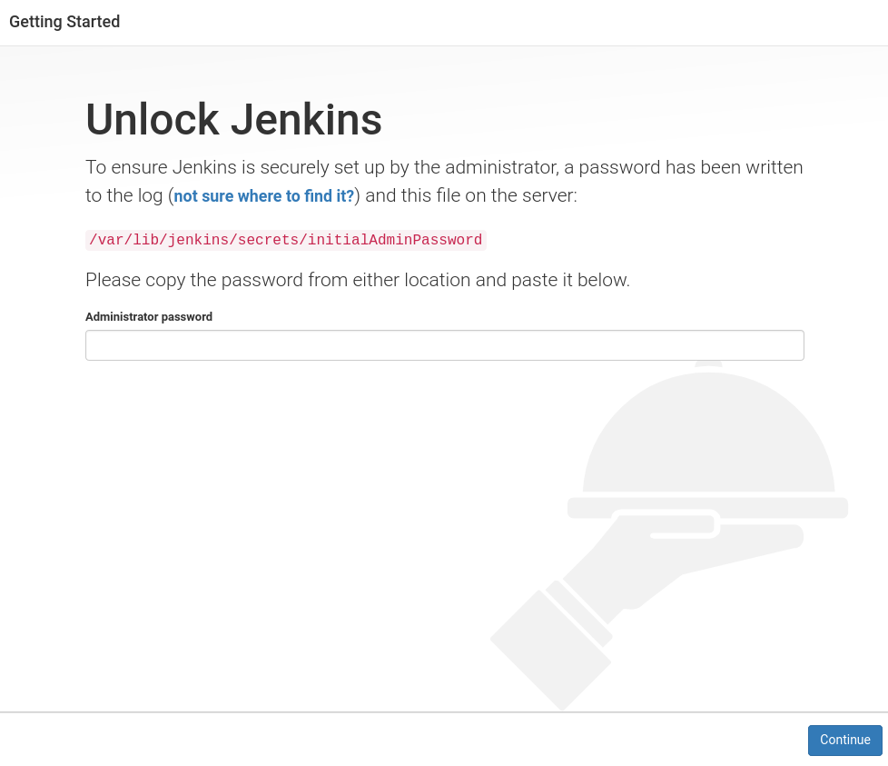
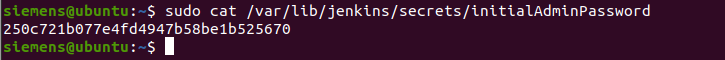
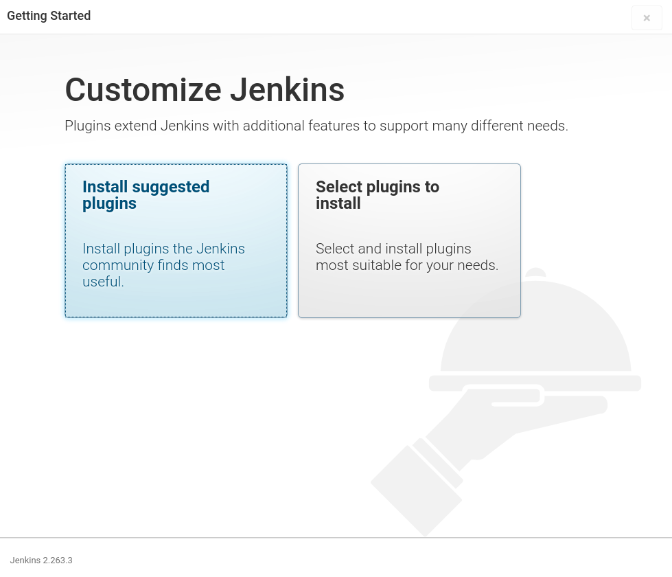
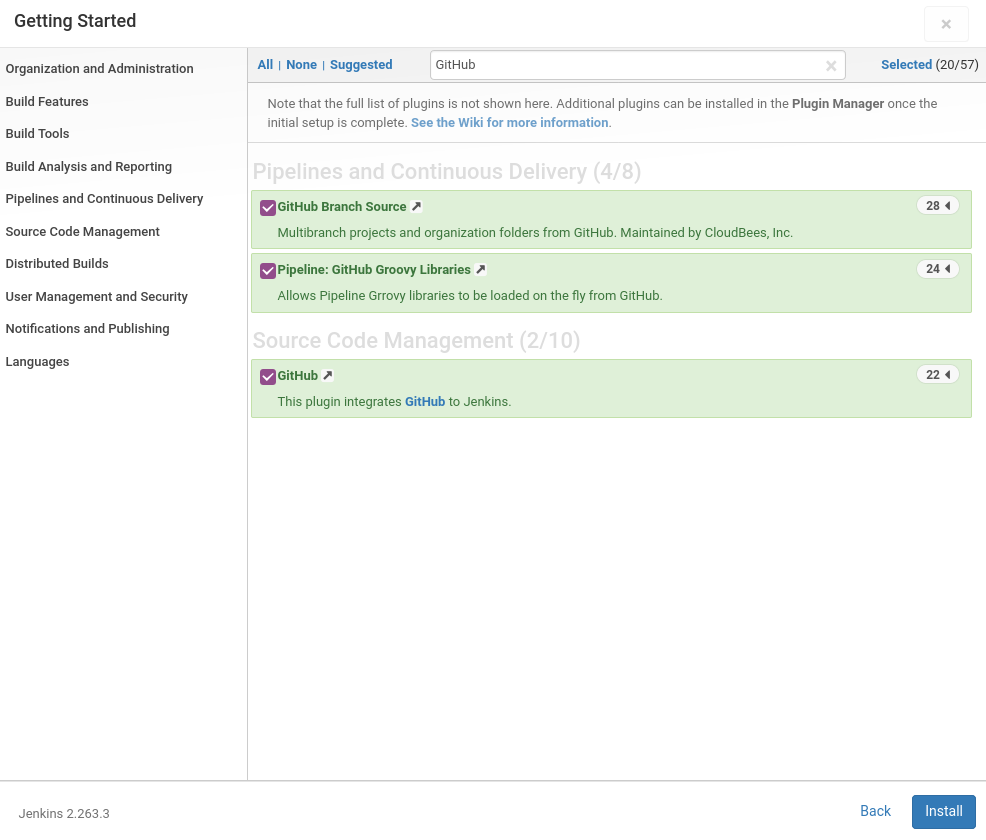
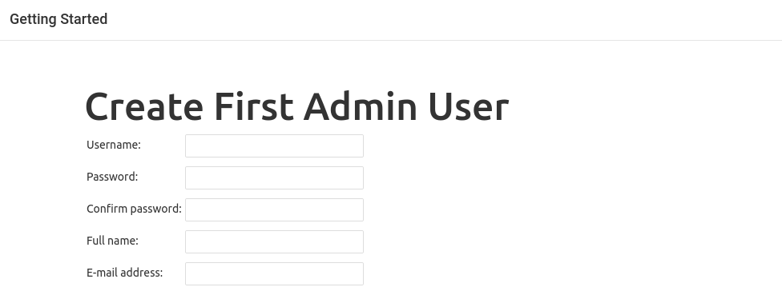

# Installation of Jenkins server

- [Installation of Jenkins server](#installation-of-jenkins-server)
  - [Installing Jenkins](#installing-jenkins)
  - [Installation steps](#installation-steps)
  - [Post-Installation steps](#post-installation-steps)
    - [Unlocking Jenkins](#unlocking-jenkins)
    - [Customize Jenkins](#customize-jenkins)
    - [Create user](#create-user)
  

## Installing Jenkins 

Further information about installing Jenkins on your device can be found [here](https://www.jenkins.io/doc/book/installing/)

Jenkins is build on top of java so it typically runs as a standalone application in its own process with the built-in Java application or in a docker container. In this example, we will install Jenkins server directly on the ubuntu development VM but remember that it is also possible to run Jenkins in docker container. 

## Installation steps 

*Note:*
*Ubuntu 20.04 is used for running Jenkins server*

To install Jenkins on your linux device, follow these instructions:  

1) Jenkins is build using Java and therefore we need to have Java installed. To do that go to your terminal and run this commands

    ```bash
    sudo apt-get update
    sudo apt-get install openjdk-8-jdk
    java -version
    ```
2) Then install Jenkins by running following commands 

    ```bash
    wget -q -O - https://pkg.jenkins.io/debian-stable/jenkins.io.key | sudo apt-key add -
    sudo sh -c 'echo deb https://pkg.jenkins.io/debian-stable binary/ > \
    /etc/apt/sources.list.d/jenkins.list'
    sudo apt-get update
    sudo apt-get install jenkins
    ```

3) You can start and check the Jenkins service with the command:

    ```bash
    sudo systemctl start jenkins
    sudo systemctl status jenkins
    ```

4) If everything has been set up correctly, you should see an output like this:

    ```bash
    Loaded: loaded (/etc/rc.d/init.d/jenkins; generated)
    Active: active (running) since Tue 2018-11-13 16:19:01 +03; 4min 57s ago
    ```


## Post-Installation steps 

### Unlocking Jenkins 
In order to start using Jenkins, you have to unlock it using initialized setup wizard. When you first access a new Jenkins instance, you are asked to unlock it using an automatically-generated password.

1) Go to [http://localhost:8080]() using your favorite browser and wait until Jenkins unlock page appears. 



2) To get administrator password, run this command 

    ```bash
    sudo cat /var/lib/jenkins/secrets/initialAdminPassword
    ```

And copy the output administrator password. 




### Customize Jenkins 

After unlocking, the Customize Jenkins page appears. Here you can install any number of useful plugins as part of your initial setup. 

For this example, we will need to connect Jenkins with GitHub and therefore we need to install GitHub plugin. 

1) Click on "Select plugins to install". 



2) Search for "GitHub plugin" in input form and check the GitHub plugin checkbox. 




3) Click on "install". The installation and setup of Jenkins with selected plugins will start automatically. 

### Create user

After succesful installation a create new user form should appear. 

1) Fill in the form in order to create new user. 



2) Click "Save and continue" -> "Save and finish" -> "Start using Jenkins". 
3) Congratulations! You are now ready to build Jenkins pipelines!