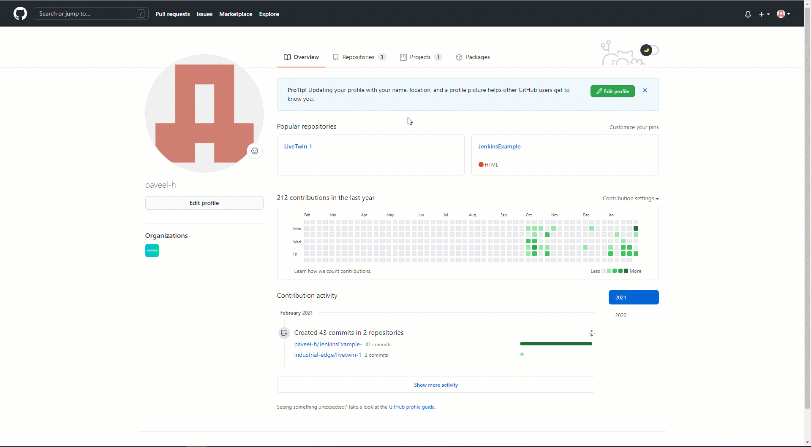

# Jenkins pipelines 

Automate process of uploading apps to IEM with Jenkins using shell script or with docker container. To demonstrate this approach, a simple nginx application is used. As a prerequisite for this task, you need to have repository on GitHub and Jenkins installed. In order to reproduce this example, follow instructions below. 

- [Jenkins pipelines](#jenkins-pipelines)
  - [Create project and application in IEM](#create-project-and-application-in-iem)
  - [Create GitHub repository](#create-github-repository)
  - [Customize Jenkins](#customize-jenkins)
    - [Shell script (Option A) - prerequisites](#shell-script-option-a---prerequisites)
      - [- Install IE Publisher CLI on Jenkins server](#--install-ie-publisher-cli-on-jenkins-server)
      - [- Expose docker daemon](#--expose-docker-daemon)
      - [- Customize docker](#--customize-docker)
        - [Post-installation step](#post-installation-step)
        - [Enable Jenkins use your docker engine](#enable-jenkins-use-your-docker-engine)
    - [Docker in Jenkins (Option B) - prerequisites](#docker-in-jenkins-option-b---prerequisites)
      - [- Install Docker Pipeline plugin.](#--install-docker-pipeline-plugin)
      - [- Push docker image with CLI to docker registry.](#--push-docker-image-with-cli-to-docker-registry)
      - [- Create Jenkins credentials for Docker Hub](#--create-jenkins-credentials-for-docker-hub)
    - [Create Jenkins environment variables (Option A and B)](#create-jenkins-environment-variables-option-a-and-b)
  - [Create Jenkins pipeline](#create-jenkins-pipeline)
  - [Trigger Pipeline job](#trigger-pipeline-job)
    - [Manual trigger](#manual-trigger)
    - [Automatic trigger (optional)](#automatic-trigger-optional)


## Create project and application in IEM 
*Prerequisites:*\
*- IEM installed and configured*

1) Go to the "App-Projects" section of your Edge Management. 

2) Click on "Create Project" button in the right upper corner. 

3) Provide necessary information for your project 

    ```txt
    - Project Name
    - Description 
    - Company information (if needed)
    ```

4) Click on "Create" to create the project. 


5) Go to your created project and click on "Create application"

6) Fill in the form for your application 

    ```txt
    - Application Name 
    - Repository Name
    - Website
    - Description
    - Select icon
    ```

7) Click on "Create" button. Your application is successfully created.


## Create GitHub repository 
*Prerequisites:*\
*- GitHub account is created*\
*- VS code is used for pushing code to remote GitHub repository*

1) Go to [github](https://github.com/) and sign in with your credentials. 

2) Navigate to your profile and with "plus" button in the right upper corner select "New repository". 

3) Give your repository the required information 

    ```txt
    - Repository name
    - Choose public repository
    ```
*Note: Public repository is chosen to shorten the length of this documentation. You can also select private repository but be aware of setting up ssh key and Jenkins credentials for successful connection with GitHub. See: [jenkins-with-private-github-repository](https://medium.com/@shreyaklexheal/integrate-jenkins-with-github-private-repo-8fb335494f7e)*



4) You can clone the empty repository to your local system in the location of your choice:

    ```sh
    git clone https://github.com/<username>/<reponame>.git
    cd <reponame>
    ```

5) Copy application folder for either shell or docker (use your preferred one) [src](./src) to the empty folder. 

6) Push this code to your GitHub repository by running these commands in your terminal: 
   
    ```bash
    git add *
    git commit -m "first commit"
    git push
    ```
*Note: If the system ask for the credentials, introduce the username and the token that you created before on settings>developer settings>Personal access tokens>Tokens (classic)*

## Customize Jenkins 
*Prerequisites:*\
*- Jenkins is installed and configured*\
*- Jenkins server is in the same subnet as IEM*


Within this example, you have two options for creating Jenkins pipeline. You can either create simple shell script or more conveniently use docker. In case you choose shell script, you need to install everything on your local Jenkins server manually. With docker you need to create a docker image. 

### Shell script (Option A) - prerequisites

#### - Install IE Publisher CLI on Jenkins server
In case you want to use shell script for your pipelines, you have to install IECTL in the operating system where you setup the Jenkins server. To install the IECTL, follow these instructions: 

1) Go to the machine, where your Jenkins server is running. 

2) Download the IECTL zip file from [Industrial Edge Hub](https://iehub.eu1.edge.siemens.cloud/downloads) and copy the file to the Jenkins machine. 

3) Open terminal in the directory with the IECTL zip file, extract it and run these commands to install it.  

    ```bash
    chmod +x iectl
    sudo mv iectl /usr/local/bin/
    ```
   If you don't have root access on the system, you can use:

    ```bash
    chmod +x iectl
    mkdir -p ~/.local/bin
    mv ./iectl ~/.local/bin/ietcl
    ```

4) Verify the installation using:

    ```bash
    iectl version
    ``` 

#### - Expose docker daemon 
In order to run shell script for this example, you need to expose docker daemon TCP port 2375. To do that, follow these instructions: 

1. Open terminal on the device where your Jenkins server is running. 
2. Use the command sudo systemctl edit docker.service to open an override file for docker.service in a text editor.
    ```bash
    sudo systemctl edit docker.service
    ```

3. Add or modify the following lines, substituting your own values.
    ```bash
    [Service]
    ExecStart=
    ExecStart=/usr/bin/dockerd -H fd:// -H tcp://127.0.0.1:2375
    ```
In this example the API will listen at `127.0.0.1:2375`. You can change the IP according to your setup, eg if you want to reach the docker engine from a external host, enter the external IP of the host.

4. Save the file.
5. Reload the systemctl configuration.
    ```bash
    sudo systemctl daemon-reload
    ```
6. Restart Docker
    ```bash
    sudo systemctl restart docker.service
    ```
7. Check if the new configuration was applied:
    ```bash
    sudo docker info
    ```
The output should state that the API is accessible on your IP and Port.

__Warning__ : Access to the remote API is equivalent to root access on the host. Only do this in a trusted environment.

#### - Customize docker

#####  Post-installation step

Add user to the docker group to run without sudo command: 

1) Create docker group
   
    ```bash
    sudo groupadd docker
    ```
2) Add your user to the docker group

    ```bash
    sudo usermod -aG docker $USER
    ```

3) Activate the changes to groups

    ```bash
    newgrp docker 
    ```

#####  Enable Jenkins use your docker engine 
To do this run these commands in your terminal: 

```bash
sudo usermod -a -G docker jenkins
sudo systemctl restart jenkins
```


### Docker in Jenkins (Option B) - prerequisites

In case you do not want to install everything on your local Jenkins server, docker in Jenkins pipeline is the best option for you. In order to use docker in Jenkins within this example, you need to install required Jenkins plugin and upload docker image that you want to use within the pipeline to docker hub or any other of yours favorite docker registry. 


#### - Install Docker Pipeline plugin. 

1) Go to "Manage Jenkins" section in Home Page. 

2) Click on "Manage Plugins" and navigate to the "Available" tab. 

3) Search for the "Docker Pipeline" plugin and install on your Jenkins server. 


#### - Push docker image with CLI to docker registry. 

By default, Jenkins is pulling docker images from [https://hub.docker.com/](https://hub.docker.com/) to use them within your pipelines. You can also use any of your favorite docker container registry. 

1) Create account and private repository in docker hub. 
2) Copy [docker](../src/docker) folder from this repository to your device. 
3) Download IECTL file from [Industrial Edge Hub](https://iehub.eu1.edge.siemens.cloud/downloads), unzip and copy that file to [dockerfile](../src/docker/dockerfile) folder.
4) Push this [docker-image](./src/docker/dockerfile/Dockerfile) to your repository using these commands 


    ```bash
    cd docker
    chmod +x iectl
    docker login -u <dockerID> -p <password>
    docker build -t <dockerID>/<repo_image> .
    docker push <dockerID>/<image>
    ```

#### - Create Jenkins credentials for Docker Hub 
To successfully pull images form your private docker container registry, you need to configure Jenkins credentials. 

1) Go to "Manage Jenkins" section in Home Page. 

2) Click on "Credentials" on the "Security" tab and click on "global" under Jenkins credential domain. 

3) Click on "Add Credentials" and fill in the form with following information: 

    ```txt
    - Username: <dockerID>
    - Password: <password>
    - ID: 'credentials-id'
    ```

4) Click "OK". Your credentials for Docker Hub has been created. 


### Create Jenkins environment variables (Option A and B)
To use environment variables in your Jenkins pipelines, follow these instructions: 

1) Go to the "Manage Jenkins" option on Home Page. 

2) Navigate to the "System Configuration" label and click on "system". Scroll down to the "Global properties" information. 

3) Check in the "Environment variables" and click "Add". 

4) Add following environment variables: 

    ```txt
    - Name: IEM_URL
    - Value: <url-of-your-iem>
    ```
    ```txt
    - Name: USER_NAME
    - Value: <ieam-username>
    ```
    ```txt
    - Name: PSWD
    - Value: <iem-password>
    ```
    ```txt
    - Name: REPO_NAME
    - Value: <app-repo-name>
    ```
    ```txt
    - Name: ICON_PATH
    - Value: <path-to-the-icon>
    ```
    ```txt
    - Name: APP_NAME
    - Value: <App-name>
    ```

    Only necessary for Docker in Jenkins (Option B)
    ```txt
    - Name: DOCKER_IMAGE_CLI
    - Value: <docker-image-cli>
    ```
5) Click on "Save".

*Notes:*\
*- IEM_URL environment variable has to be this format: https://iemip:9443* \
*- App ID can be found in IEM under "My Projects -> Application Details -> Show Keys"*
*- The iconpath is the path of the icon inside the image. You have to check it where is on the image using the Dockerfile file*


## Create Jenkins pipeline

1) Go to "New Item" section in the Home Page. 

2) Click on "Pipeline" and give your pipeline a name. 

3) Click "OK". Configuration page opens. 

4) In the "General" section, check the "GitHub project" checkbox and provide your GitHub project url. 

5) In the "Build Triggers" check the "GitHub hook trigger for GITScm polling" option. 

6) In "Pipeline" section choose "Pipeline script from SCM" from the Definition drop-down list. 

7) For the "SCM" option, select "Git" and enter your repository url.\
   *Note: Credentials is in this case not needed since the repository is public.*

8) Select branch you want your pipeline build from. 

9) Click Apply & Save. Your Pipeline is successfully created!


## Trigger Pipeline job 

To trigger your pipeline job, you have two options. You can either trigger it manually or setup GitHub webhook to automatically trigger pipeline on every code push to your repository. 

### Manual trigger 
To manually trigger your pipeline, follow these steps: 

1) Go to your pipeline dashboard

2) Click on "Build Now" option in the navigation bar. 

3) You can monitor the pipeline results in "Console Output". 


### Automatic trigger (optional)

GitHub by default provide a feature so called Webhooks. Webhooks allow external services to be notified when certain events happen. We can use this in our example to send notification from GitHub to Jenkins when the code is pushed to the repository and the pipeline will trigger automatically. 

The problem is, that the Jenkins server has to be exposed to the public internet. We can do this in a secure way by using Webhook Relay. The documentation can be found [here](https://webhookrelay.com/). 

An example on how to setup Webhook relay to connect GitHub with local Jenkins can be found [here](https://webhookrelay.com/blog/2017/11/23/github-jenkins-guide/). 

To setup GitHub Webhook with Webhook relay, follow these steps: 


1) Get The Webhook relay agent by running these commands 

    ```bash
    sudo wget -O /usr/local/bin/relay https://storage.googleapis.com/webhookrelay/downloads/relay-linux-amd64
    sudo chmod +wx /usr/local/bin/relay
    ```

2) Go to the [https://my.webhookrelay.com/register](https://my.webhookrelay.com/register) and sign up by creating an account. 

3) Go to [https://my.webhookrelay.com/tokens](https://my.webhookrelay.com/tokens) and click on "Generate Token". New token is generated. 

4) Authenticate your Webhook relay for the Jenkins server 

    ```bash
    relay login -k token-key-here -s token-secret-here
    ```
5) You will then need to start forwarding webhooks to Jenkins

    ```bash
    relay forward --bucket github-jenkins http://localhost:8080/github-webhook/
    ```
It will generate a url for your Webhook relay server that can be used to forward request inside GitHub Webhooks

6) Go to your GitHub repository and navigate to "Settings" section. 

7) Go to the "Webhooks" section and click on "Add webhook" button. 

8) For The "Payload URL", provide the url from your Webhook Agent in this form: `https://<id>.hooks.webhookrelay.com`

9) Select `application/json` for the "Content type"  and click "Add webhook". 

10) Congratulations! You are ready to trigger your pipeline on every commitment to your repository but keep in mind that the first build has to be done manually. 


