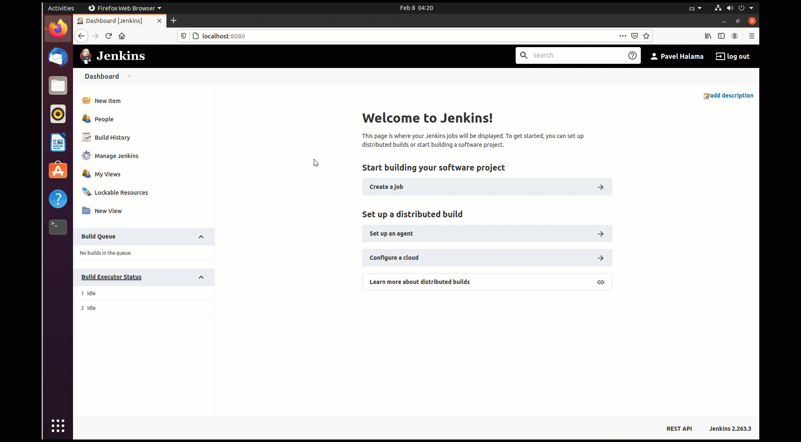

# Creating Jenkins pipelines using shell script

Automate process of uploading apps to IEM with Jenkins using shell script. To demonstarte this approach, a simple nginx application is used. As a prerequisity for this task you need to have repository on GitHub, Jenkins installed and setup GitHub webhook to connect them. In order to complete this, follow instructions below. 

- [Creating Jenkins pipelines using shell script](#creating-jenkins-pipelines-using-shell-script)
  - [Create project and application in IEM](#create-project-and-application-in-iem)
  - [Create GitHub repository](#create-github-repository)
  - [Customize Jenkins](#customize-jenkins)
    - [Shell script - prerequisities](#shell-script---prerequisities)
      - [Install IE Publisher CLI on Jenkins server](#install-ie-publisher-cli-on-jenkins-server)
    - [Docker in Jenkins - prerequisities](#docker-in-jenkins---prerequisities)
      - [Install Docker Pipeline plugin.](#install-docker-pipeline-plugin)
      - [Push docker image with CLI to docker registery.](#push-docker-image-with-cli-to-docker-registery)
      - [Create Jenkins credentials for Docker Hub](#create-jenkins-credentials-for-docker-hub)
    - [Create Jenkins environment variables](#create-jenkins-environment-variables)
  - [Create Jenkins pipeline](#create-jenkins-pipeline)
  - [Create GitHub webhook](#create-github-webhook)


## Create project and application in IEM 
*Prerequisities:*

*- IEM isntalled and configured*

1) Go to the "Applications" section of your Edge Management system. 

2) Click on "Create Project" button in the right upper corner. 

3) Provide necessary information for your project 

    ```txt
    - Project Name
    - Description 
    - Company information (if needed)
    ```

4) Click on "Create" to create the project. 


5) Go to your created project and clisk on "Create application"

6) Fill in the form for your application 


    ```txt
    - Application Name 
    - Repository Name
    - Website
    - Sescription
    - Select icon
    ```

7) Click on "Create" button. Your application is succesfully created.


## Create GitHub repository 
*Prerequisities:*

*- GitHub account is created*

*- VS code is used for pushing code to remote GitHub repository*

1) Go to [github](https://github.com/) and sign in with your credentials. 

2) Navigate to your profile and with "plus" button in the right upper corner select "New repository". 

3) Give your repository required information 

    ```txt
    - Repository name
    - Choose public repository
    ```
*Note: Public repository is chosen to shorten the lenght of this documentation. You can also select private but be aware of setting up ssh key and Jenkins credentials for succesfull connection with GitHub. See: [jenkins with private github reposiotory](https://medium.com/@shreyaklexheal/integrate-jenkins-with-github-private-repo-8fb335494f7e)*


4) Clone this repository to your local development PC using `git clone <repositoryURL>` command. 

5) Open VS code inside of an empty folder. 

6) Copy application file from either shell or docker [src](./src) folder to your empty folder (use your prefered one). 

7) Push this code to your repository by running this commands in terminal: 
   
    ```bash
    git init
    git add --all
    git commit -m "first commit"
    git branch -M main
    git remote add origin https://github.com/<yourrepositoryname>.git
    git push -u origin main
    ```


## Customize Jenkins 
*Prerequisities:*

*- Jenkins is installed and configured*

*- Jenkins server is in the same subnet as IEM*

*- For using docker in Jenkins - Docker image with CLI is pushed in Docker Hub* 

Within this example, you have two options for creating Jenkins pipeline. You can either create simple shell script or more conveniently; use docker. In case you chose shell script, you need to install everything on your local Jenkins server manually. With docker you do not need to install anything. 

### Shell script - prerequisities

####  Install IE Publisher CLI on Jenkins server
In case you want to use shell script for your pipelines, you have to install Publisher CLI on the Jenkins server. To install IE Publisher CLI, follow this instruction: 

1) Go to the machine, where your Jenkins server is running. 

2) Copy IE Publisher CLI installation [file](../../IE_Publisher_CLI/ie-app-publisher-linux) to your device. 

3) Open up terminal in the folder where the istallation file is located and run this command 

    ```bash
    sudo cp ie-app-publisher-linux /usr/bin
    ```

5) To test whether your installation was succesfull run this command:

    ```bash
    sudo ie-app-publisher-linux --version
    ```


6) If you see the publisher CLI version number, you have successfully installed IE Publisher CLI on your device. 

### Docker in Jenkins - prerequisities

In case you do not want to install everything on your local Jenkins server, docker in Jenkins pipeline is the best option for you. In order to use docker in Jenkins within this example, you need to install required Jenkins plugin and upload docker image that you want to use within the pipeline to docker hub or any other of yours favourite docker registery. 


#### Install Docker Pipeline plugin. 

1) Go to "Manage Jenkins" section in Home Page. 

2) Click on "Manage Plugins" and navigate to the "Available" tab. 

3) Search for the "Docker Pipeline" plugin and install on your Jenkins server. 


#### Push docker image with CLI to docker registery. 

By default, Jenkins is pulling docker images from [https://hub.docker.com/](https://hub.docker.com/) to use them within your pipelines. You can also use any of your favourite docker container registery. 

1) Create account and private repository on docker hub. 
2) Push this [docker-image](./src/docker/dockerfile/Dockerfile) using these commands 


    ```bash
    docker login -u <dockerID> -p <password>
    docker build -t <image> .
    docker push <image>
    ```

#### Create Jenkins credentials for Docker Hub 
To successfully pull images form your private docker container repository, you need to configure Jenkins credentials. 

1) Go to "Manage Jenkins" section in Home Page. 

2) Click on "Manage Credentials" tab and click on "global" under Jenkins credential domain. 

3) Click on "Add Credentials" and fill in the form with following information: 


    ```txt
    - Username: <dockerID>
    - Password: <password>
    - ID: 'credentials-id'
    ```
4) Click "OK". Your credentials for Docker Hub has been created. 




### Create Jenkins environment variables
To use envrironment variables in your Jenkins pipelines, follow these instructions: 

1) Go to the "Manage Jenkins" otpion in Home Page. 

2) Navigate to the "Configure System" tab and scroll down to the "Global properties" information. 

3) Check in the "Environment variables" and click "Add". 

4) Add following enviroment variables: 

    ```txt
    - Name: IEM_URL
    - Value: <url-of-your-iem>
    ```
    ```txt
    - Name: USER_NAME
    - Value: <ieam-username>
    ```
    ```txt
    - Name: PSWD
    - Value: <iem-password>
    ```
    ```txt
    - Name: APP_ID
    - Value: <application-ID>
    ```
*Note: App ID can be found in IEM under "My Projects -> Application Details -> Show Keys"*


## Create Jenkins pipeline

1) Go to "New Item" section in the Home Page. 

2) Click on "Pipeline" and give your pipeline a name. 

3) Click "OK". Configuration page opens. 

4) In the "General" section, check the "GitHub project" checkbox and provide your GitHub project url. 

5) In the "Build Triggers" check the "GitHub hook trigger for GITScm polling" option. 

6) In "Pipeline" section choose "Pipeline script from SCM" from the Definition drop-down list. 

7) For the "SCM" option, select "Git" and enter your repository url. 
   *Note: Credentials is in this case not needed since the repository is public.*

8) Select branch you want your pipeline build from. 

9) Clik Apply & Save. Your Pipeline is succesfully created!


## Create GitHub webhook