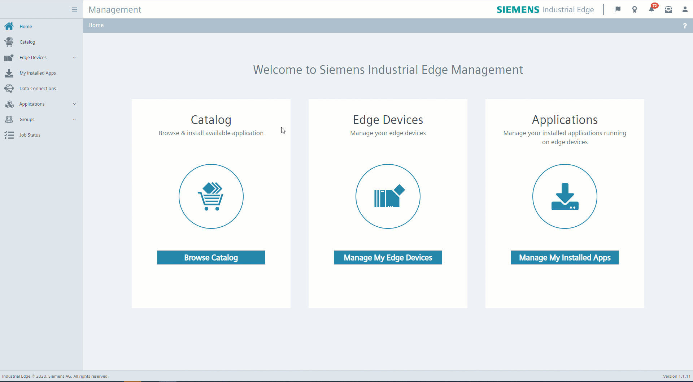
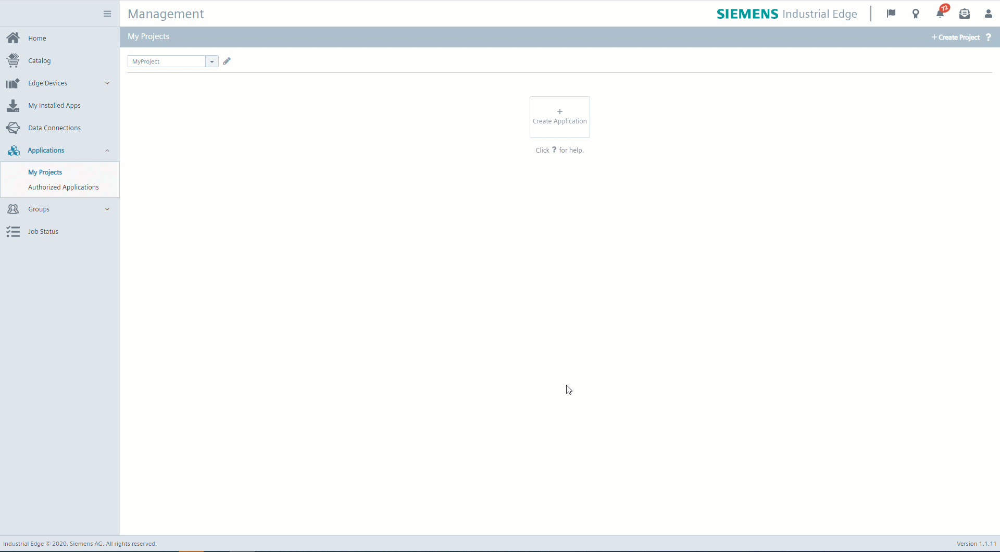

# Creating Jenkins pipelines using shell script

Automate process of uploading apps to IEM with Jenkins using shell script. To demonstarte this approach, a simple nginx application is used. As a prerequisity for this task you need to have repository on GitHub, Jenkins installed and setup GitHub webhook to connect them. In order to complete this, follow instructions below. 

- [Creating Jenkins pipelines using shell script](#creating-jenkins-pipelines-using-shell-script)
  - [Create project and application in IEM](#create-project-and-application-in-iem)
  - [Create GitHub repository](#create-github-repository)
  - [Create Jenkins pipeline](#create-jenkins-pipeline)
  - [Create GitHub webhook](#create-github-webhook)


## Create project and application in IEM 
*Prerequisities:*
*- IEM isntalled and configured*

1) Go to the "Applications" section of your Edge Management system. 

2) Click on "Create Project" button in the right upper corner. 

3) Provide necessary information for your project 

    ```txt
    - Project Name
    - Description 
    - Company information (if needed)
    ```

4) Click on "Create" to create the project. 




5) Go to your created project and clisk on "Create application"

6) Fill in the form for your application 


    ```txt
    - Application Name 
    - Repository Name
    - Website
    - Sescription
    - Select icon
    ```

7) Click on "Create" button. Your application is succesfully created.




## Create GitHub repository 
*Prerequisities:*
*- GitHub account is created*
*- VS code is used for pushing code to remote GitHub repository*

1) Go to [github](https://github.com/) and sign in with your credentials. 

2) Navigate to your profile and with "plus" button in the right upper corner select "New repository". 

3) Give your repository required information 

    ```txt
    - Repository name
    - Choose public repository
    ```
*Note: Public repository is chosen to shorten the lenght of this documentation. You can also select private but be aware of setting up ssh key and Jenkins credentials for succesfull connection with GitHub. See: [jenkins with private github reposiotory](https://medium.com/@shreyaklexheal/integrate-jenkins-with-github-private-repo-8fb335494f7e)*


4) Clone this repository to your local development PC using `git clone <repositoryname>` command. 

5) Open VS code inside of an empty folder. 

6) Copy application file from shell [src](./pipelines/shell/src) folder to the empty folder. 

7) Push this code to your repository by running this commands in terminal: 
   
    ```bash
    git init
    git add --all
    git commit -m "first commit"
    git branch -M main
    git remote add origin https://github.com/paveel-h/JenkinsShell.git
    git push -u origin main
    ```


## Create Jenkins pipeline

## Create GitHub webhook